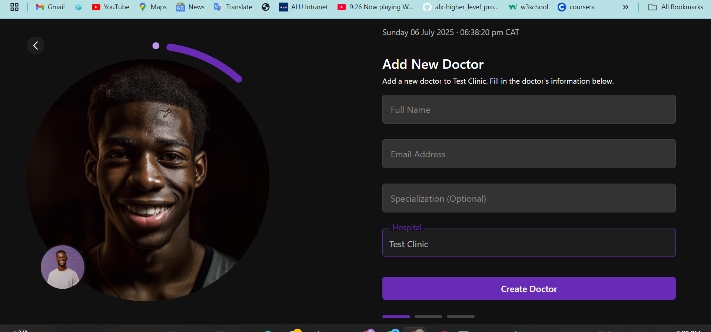
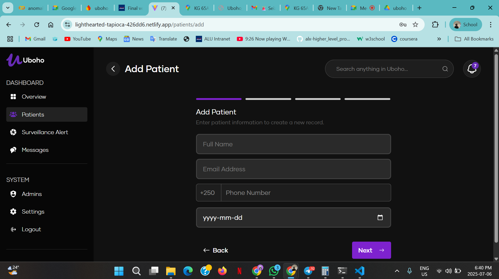
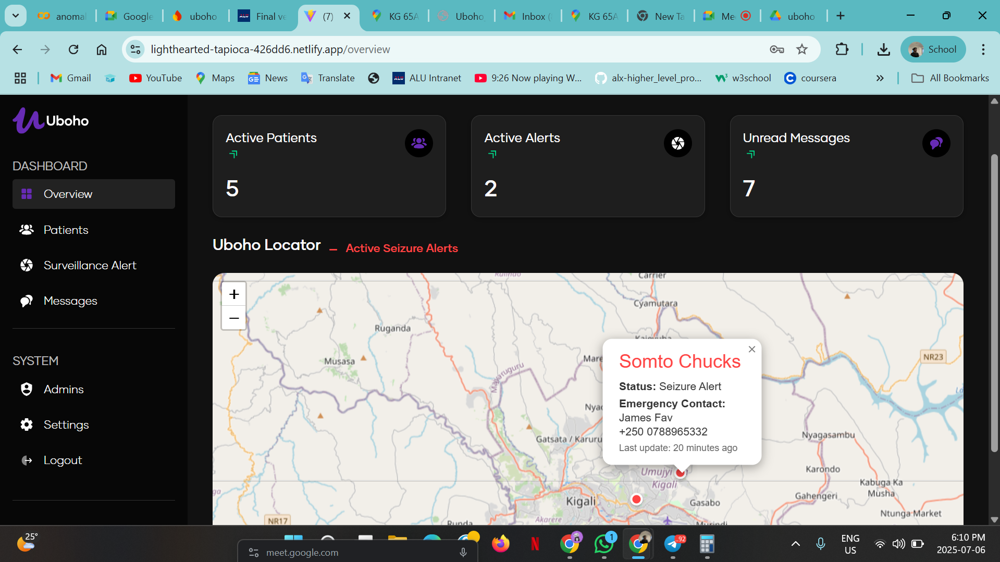
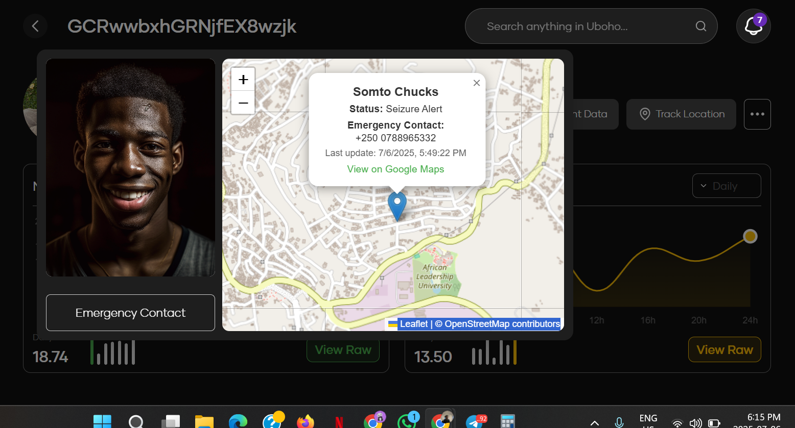
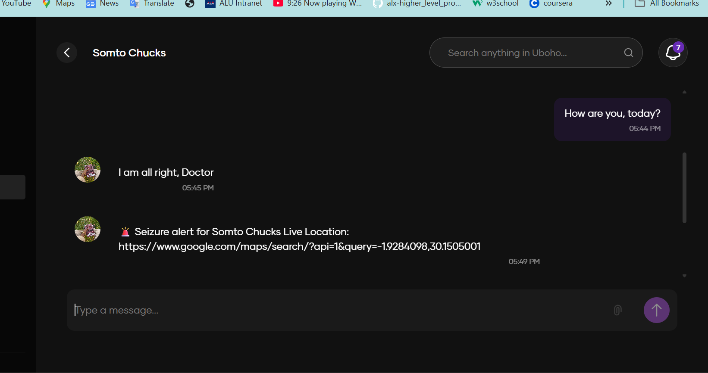
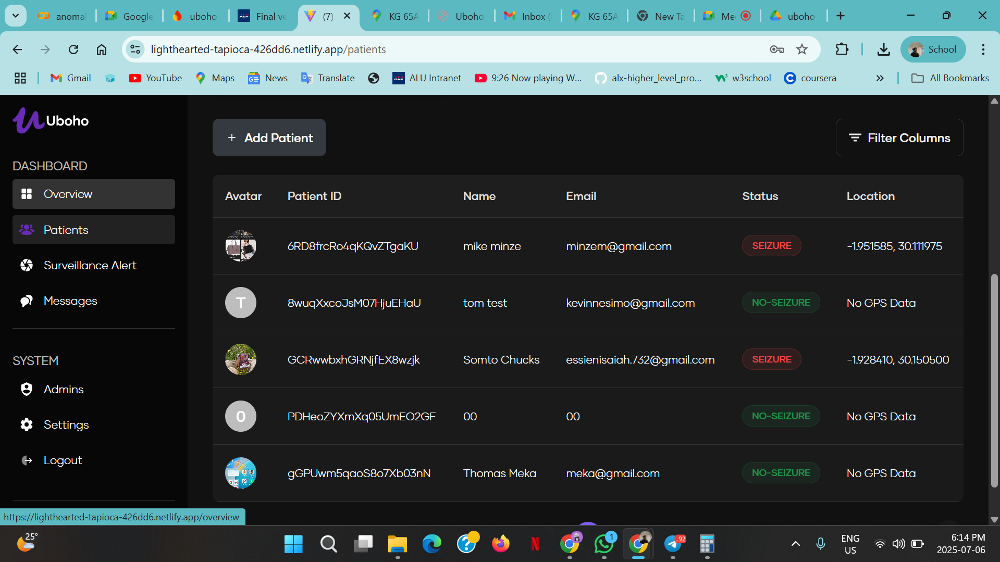
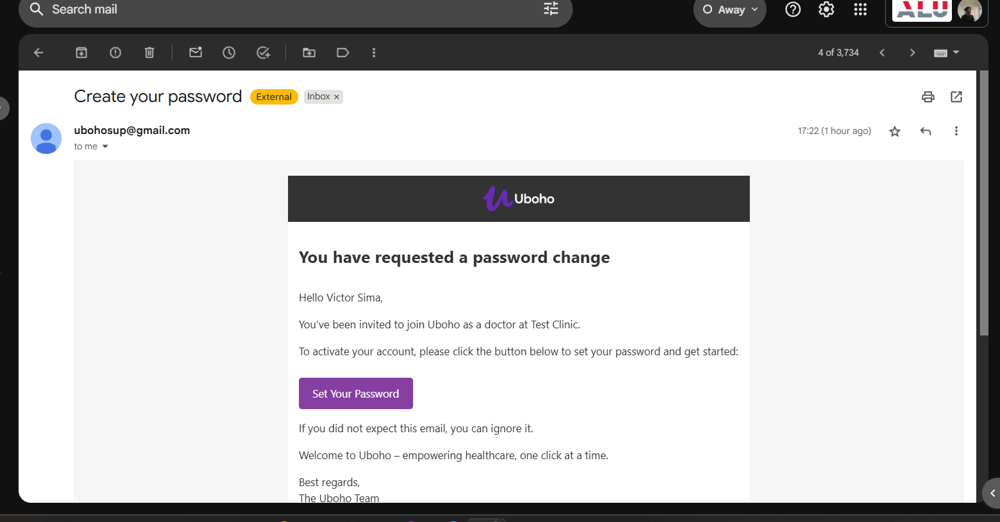

# Uboho Dashboard


A comprehensive healthcare dashboard application built with React and Vite for managing patient data, visualizing health statistics, and providing real-time monitoring capabilities.


## Relevant Links
- [Demovideo](https://drive.google.com/file/d/1XLzOHM6Bv0CMiRLJ8UZinhGnnOnriDTX/view?usp=sharing)
- [Figma design](https://www.figma.com/design/EjFiGZ5k5acmHJRQBd7kbL/Uboho?node-id=27-572&t=KELwLbz414nI3asK-1)
- [Link to repo](https://github.com/Isaiah-Essien/uboho_web_dashboard)
- [Final Deployed Link](https://lighthearted-tapioca-426dd6.netlify.app/)
- [Link to Mobile_app repo](https://github.com/Isaiah-Essien/uboho_mobile)
- [Link to result Analysis](https://docs.google.com/document/d/1VcpaDektwOJMmtjM2LOTRAUTh_5AqvCrXtK0OyX-ykY/edit?usp=sharing)


## How the Dashoard works:

1. A medical Orginzation(hospital/clinic) purchases the system
2. An admin is created
3. The admin Logs in and adds other doctors and patients

4. The new doctors create passwords, logs in and add patients


## Screenshots & Demos

### Dashaboard



### Emergency Location Sharing


### Patient–Doctor Chat


### All Patients


### Sample of Doctor Invitation

---


## ⚡ Quick Start

### Automated Setup (Recommended)

**For Windows PowerShell:**

```powershell
.\setup.ps1
```

**For Windows Command Prompt:**

```cmd
setup.bat
```

### Manual Setup

1. **Install Dependencies**

   ```bash
   npm install
   ```

2. **Start Development Server**

   ```bash
   npm run dev
   ```

3. **Open Browser**
   Navigate to `http://localhost:5173`

##  Prerequisites

- Node.js 18.0.0 or higher
- npm 8.0.0 or higher

##  Features

- **Patient Management** - Add, view, and manage patient records
- **Interactive Dashboard** - Real-time statistics and analytics
- **Map Integration** - Location-based patient tracking with Leaflet
- **Data Visualization** - Charts and graphs using Chart.js and Recharts
- **Search Functionality** - Global search across all application data
- **Responsive Design** - Mobile-friendly interface
- **Admin Panel** - Administrative functions and user management
- **Message System** - Communication and notification features

## 🛠 Available Scripts

- `npm run dev` - Start development server
- `npm run build` - Build for production
- `npm run lint` - Run ESLint for code quality
- `npm run preview` - Preview production build

##  Project Structure

```
src/
├── components/       # Reusable React components
├── pages/           # Page components (Overview, Patients, etc.)
├── utils/           # Utility functions and helpers
├── fonts/           # Custom fonts
└── assets/          # Images and static assets
```

##  Technology Stack

- **Frontend**: React 19, React Router DOM
- **Build Tool**: Vite
- **Styling**: Bootstrap, Custom CSS
- **Charts**: Chart.js, Recharts
- **Maps**: Leaflet, React Leaflet
- **Code Quality**: ESLint

##  Documentation

- [Setup Guide](SETUP.md) - Detailed installation and setup instructions
- [Dependencies](DEPENDENCIES.md) - Complete list of project dependencies

##  Troubleshooting

If you encounter issues:

1. **Clear cache and reinstall**

   ```bash
   npm cache clean --force
   rm -rf node_modules package-lock.json
   npm install
   ```

2. **Check Node.js version**

   ```bash
   node --version
   ```

3. **Run on different port**
   ```bash
   npm run dev -- --port 3000
   ```

##  Contributing


 - Submit a contribution request to the author


---

## Author:
- Isaiah Essien