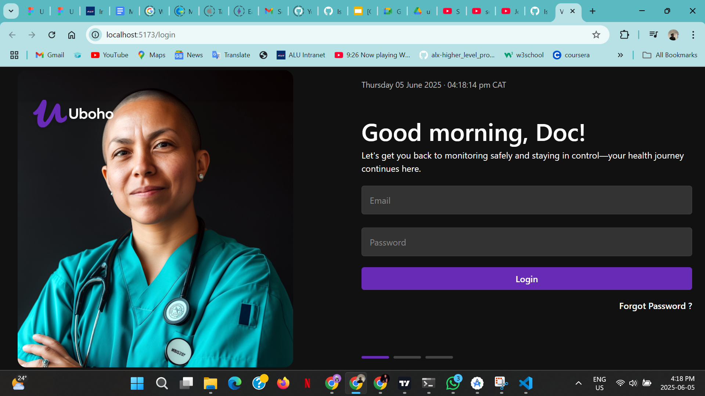
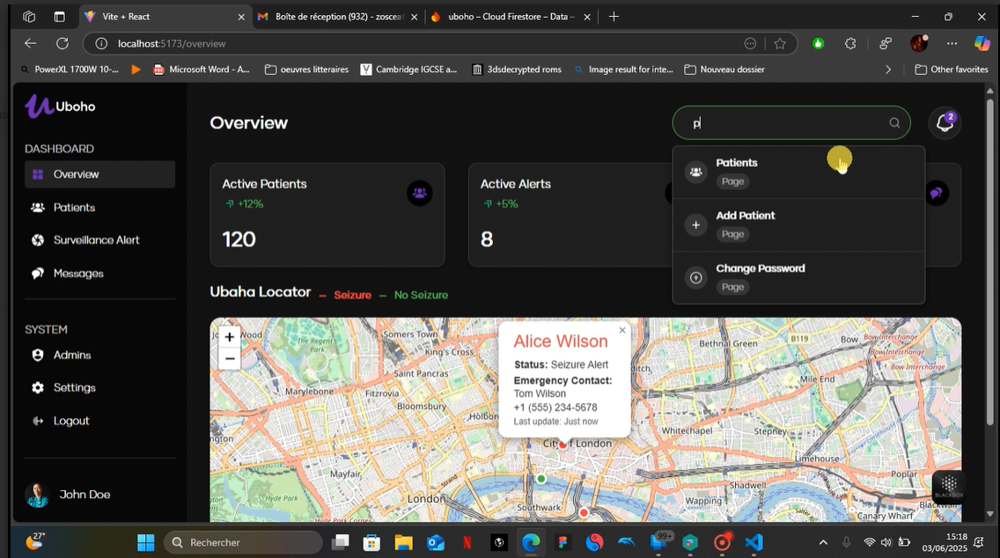
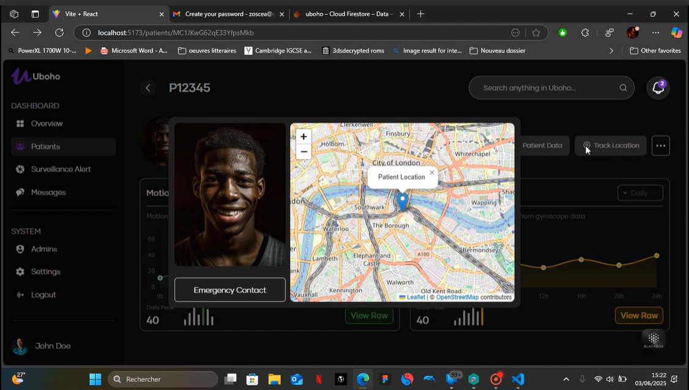
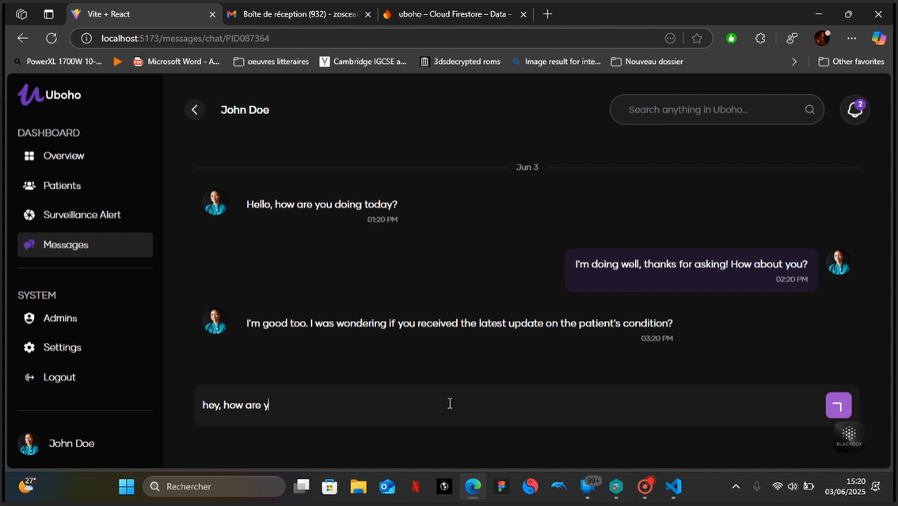

# Uboho Dashboard



A comprehensive healthcare dashboard application built with React and Vite for managing patient data, visualizing health statistics, and providing real-time monitoring capabilities.


## Relevant Links
- [Demovideo](https://drive.google.com/file/d/14WXmmZ6_gm_oLvGo59iwW-YrxHWmAgIx/view?usp=sharing)
- [Figma design](https://www.figma.com/design/EjFiGZ5k5acmHJRQBd7kbL/Uboho?node-id=27-572&t=KELwLbz414nI3asK-1)
- [Link to repo](https://github.com/Isaiah-Essien/uboho_web_dashboard)

## Screenshots & Demos

### Dashaboard



### Emergency Location Sharing


### Patient–Doctor Chat


---


## ⚡ Quick Start

### Automated Setup (Recommended)

**For Windows PowerShell:**

```powershell
.\setup.ps1
```

**For Windows Command Prompt:**

```cmd
setup.bat
```

### Manual Setup

1. **Install Dependencies**

   ```bash
   npm install
   ```

2. **Start Development Server**

   ```bash
   npm run dev
   ```

3. **Open Browser**
   Navigate to `http://localhost:5173`

##  Prerequisites

- Node.js 18.0.0 or higher
- npm 8.0.0 or higher

##  Features

- **Patient Management** - Add, view, and manage patient records
- **Interactive Dashboard** - Real-time statistics and analytics
- **Map Integration** - Location-based patient tracking with Leaflet
- **Data Visualization** - Charts and graphs using Chart.js and Recharts
- **Search Functionality** - Global search across all application data
- **Responsive Design** - Mobile-friendly interface
- **Admin Panel** - Administrative functions and user management
- **Message System** - Communication and notification features

## 🛠 Available Scripts

- `npm run dev` - Start development server
- `npm run build` - Build for production
- `npm run lint` - Run ESLint for code quality
- `npm run preview` - Preview production build

##  Project Structure

```
src/
├── components/       # Reusable React components
├── pages/           # Page components (Overview, Patients, etc.)
├── utils/           # Utility functions and helpers
├── fonts/           # Custom fonts
└── assets/          # Images and static assets
```

##  Technology Stack

- **Frontend**: React 19, React Router DOM
- **Build Tool**: Vite
- **Styling**: Bootstrap, Custom CSS
- **Charts**: Chart.js, Recharts
- **Maps**: Leaflet, React Leaflet
- **Code Quality**: ESLint

##  Documentation

- [Setup Guide](SETUP.md) - Detailed installation and setup instructions
- [Dependencies](DEPENDENCIES.md) - Complete list of project dependencies

##  Troubleshooting

If you encounter issues:

1. **Clear cache and reinstall**

   ```bash
   npm cache clean --force
   rm -rf node_modules package-lock.json
   npm install
   ```

2. **Check Node.js version**

   ```bash
   node --version
   ```

3. **Run on different port**
   ```bash
   npm run dev -- --port 3000
   ```

##  Contributing


 - Submit a contribution request to the author


---


## Uboho App


**Uboho** is a real-time mobile monitoring application designed for individuals living with epilepsy. It passively captures motion and rotation data using smartphone sensors, applies AI-based seizure detection models, and connects patients to healthcare providers through real-time alerts, communication, and remote monitoring.

---


## AI Model

The app integrates an on-device seizure detection model:

- **Model Type**: Convolutional Neural Network (CNN) or CNN + LSTM
- **Input Features**: Accelerometer and gyroscope sequences in fixed windows
- **Output**: Binary classification (Seizure or Non-seizure)
- **Deployment**: TensorFlow Lite model integrated in the app for low-latency inference

The model is trained offline using labeled motion data and updated as part of app upgrades.

---

## Emergency Workflow

1. Seizure-like activity is detected.
2. An alert is triggered within the app.
3. Current location is captured.
4. Alert and location are sent to the doctor’s dashboard.
5. Doctor receives real-time notification and patient status.

---

## Doctor Dashboard

Data is passed from the App to the hospital or doctor's dashboard via firebase on a web-based platform built with React and Firebase. Doctors can:

- View assigned patient profiles and motion history
- Receive real-time alerts when a seizure is detected
- View patient location on seizure events
- Chat with patients in need
- Manage accounts and monitor patient compliance

Each doctor receives a unique login ID and patients are automatically linked upon account creation.

---


Built with ❤️ using React + Vite
